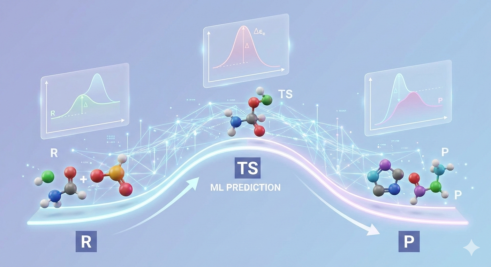

# Machine Learning Approaches for Efficient and Accurate Reaction Network Analysis

  

This repository contains **training materials and a practice notebook** for applying **machine learning to chemical reactions**. The tutorials guide you through a complete workflow to predict **reaction enthalpies, barrier heights, and related properties** using both **direct learning** and **Δ-learning approaches**.

Throughout the tutorial, you will learn how to:  
- **Prepare reaction datasets** with metadata and isolated atoms.  
- **Visualize reaction pathways** (R → TS → P) to understand structural changes.  
- **Train ML models** directly on DFT energies and evaluate their performance.  
- **Apply Δ-learning** to combine fast semi-empirical methods (like GFN2-xTB) with ML corrections. 
- **Assess model accuracy** using errors and scatter plots, and compare baseline vs ML-corrected results.

## Notebook
You can run the notebooks directly in Google Colab:

👉 **[Open Training Notebook](https://colab.research.google.com/github/OmarRodriguezLopez1398/ML_Corrections_Reactions_Training/blob/main/Tutorial.ipynb)**
